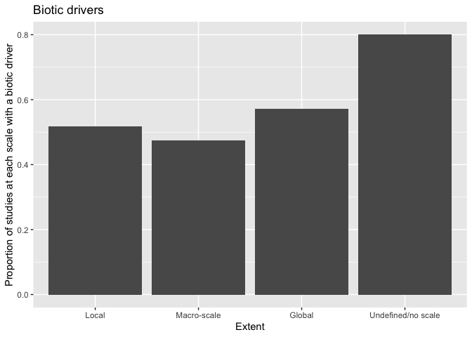
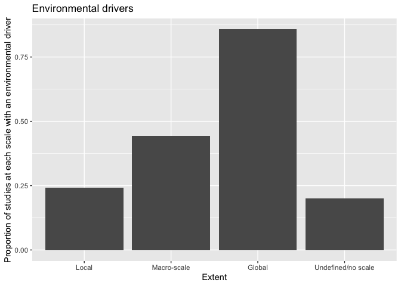
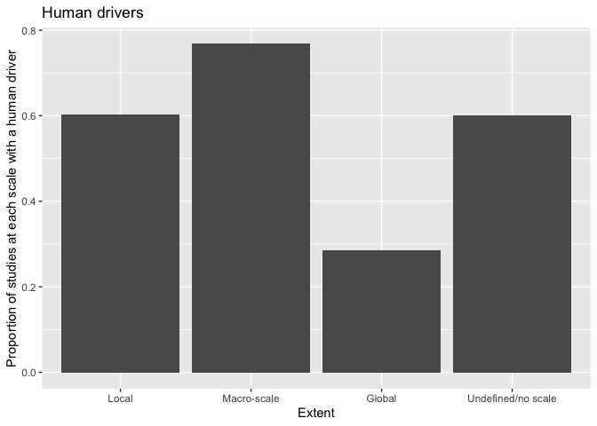
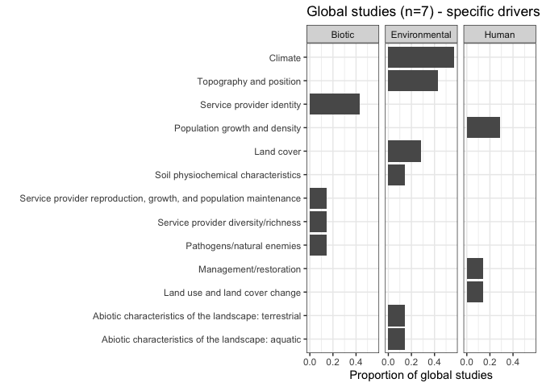
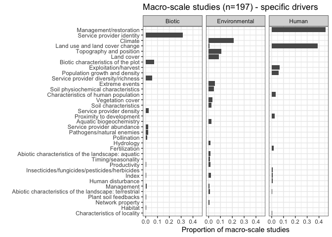
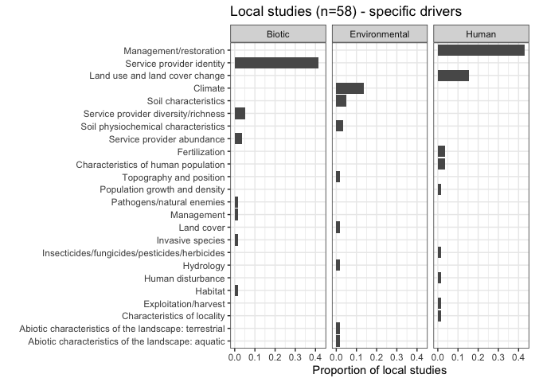

Drivers and scale intersections
================

### Proportion of studies that studied each type of driver broken down by scale

These first three plots show the proportion of studies at each scale
that consider biotic, environmental, and human drivers. These
proportions were calculated out of the totals for each scale, so if
every local study considered a biotic variable, that bar would be at 1.
I could also do this from the opposite perspective, asking how many
studies that considered biotic drivers were in each scale, if that is
more applicable. Either way, I think the plots in the next section will
be more useful in general.

<!-- -->

This figure shows the proportion of studies (out of the total number
within each scale bin) that studied a biotic driver.

<!-- -->

This figure shows the proportion of studies (out of the total number
within each scale bin) that studied an environmental driver.

<!-- -->

This figure shows the proportion of studies (out of the total number
within each scale bin) that studied a human driver.

## Specific drivers at different scales

Here, I’ve made three figures (one for each scale bin) that shows the
proportion of studies within that scale bin that considered specific
types of drivers. The drivers are also broken out among their groups
(biotic, environmental,
human).

<!-- --><!-- --><!-- -->
